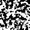

# nanogram/pattern solver lib, with cli interface

Can be runned from user-inputs, or by loading files in json, txt or [SGT](http://www.chiark.greenend.org.uk/~sgtatham/puzzles/)-format

Can save as json, or export as png

See [example.bash](example.bash) to see how it solved this 50x50

The randomized puzzle looks like random pixels, but if you use patterns from puzzle magazines, you get cooler pictures.
(avoiding the share thous pictures, as they may be copyrighted)
